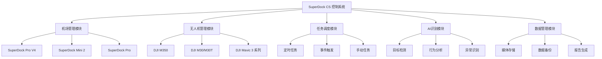

# 基本概念

本文档介绍草莓创新 SuperDock 自动机场系统的核心概念和术语，帮助您更好地理解和使用系统。

## 核心组件

### 🏭 自动机场 (SuperDock)

自动机场是整个系统的核心硬件设备，为无人机提供自动起降、充电/换电、存储和保护功能。

#### SuperDock Pro V4
- **定位**: 专业级大型自动机场
- **特点**: 极速换电、双RTK、小型化设计
- **适用场景**: 大范围、高频次巡检任务

#### SuperDock Mini 2
- **定位**: 便携式小型自动机场
- **特点**: 集成化设计、自研模块、轻量化
- **适用场景**: 小范围、灵活部署的巡检任务

#### SuperDock Pro
- **定位**: 标准专业级自动机场
- **特点**: 独立通信塔、RTK基站、高稳定性
- **适用场景**: 固定区域长期部署

### 🧠 控制系统 (SuperDock CS)

控制系统是软件平台，负责管理机场、无人机、任务调度和数据处理。

#### 核心功能
- **设备管理**: 机场和无人机的统一管理
- **任务调度**: 自动化任务规划和执行
- **数据处理**: 媒体文件处理和AI识别
- **系统监控**: 实时状态监控和报警

#### API 兼容性
- **DJI 上云 API**: 完全兼容DJI官方API
- **第三方集成**: 支持与现有系统无缝集成
- **标准协议**: 遵循行业标准通信协议

### 🚁 无人机 (Drone)

系统支持多种DJI无人机型号，通过自动配对实现智能控制。

#### 支持型号
- **DJI M350 RTK**: 专业级行业无人机
- **DJI M30/M30T**: 紧凑型行业无人机
- **DJI Mavic 3E/3T/3M**: 企业级便携无人机
- **DJI M300 RTK**: 经典专业无人机（需RC Plus）

## 关键概念

### 📍 无限跳飞 (Multi-Dock Flight)

无限跳飞是草莓创新的核心技术特色，允许无人机在多个机场之间自由飞行。

#### 工作原理
1. **路径规划**: 系统自动规划最优飞行路径
2. **电量管理**: 智能计算电量消耗和充电需求
3. **机场协调**: 多机场之间协调起降时间
4. **任务延续**: 在不同机场间延续执行任务

#### 应用场景
- **大范围巡检**: 覆盖10公里以上的巡检区域
- **线性巡检**: 沿着管道、铁路等线性设施巡检
- **区域覆盖**: 多个分散区域的综合巡检

### 🤖 AI 智能识别

AI智能识别是系统的核心功能，提供实时目标检测和分析。

#### 识别能力
- **人员检测**: 识别人员位置、数量、行为
- **车辆识别**: 检测各类车辆类型和状态
- **设备监控**: 识别设备状态和异常情况
- **环境分析**: 检测环境变化和安全隐患

#### 自定义训练
- **模型定制**: 根据客户需求训练专用模型
- **数据标注**: 提供数据标注和模型优化服务
- **持续学习**: 模型持续优化和准确率提升

### 🔄 自动化流程

系统提供端到端的自动化巡检流程，最大化减少人工干预。

#### 完整流程
1. **任务触发**: 定时或事件触发任务执行
2. **预飞检查**: 自动检查设备状态和环境条件
3. **自动起飞**: 无人机从机场自动起飞
4. **路径执行**: 按照预设路径进行巡检
5. **数据采集**: 自动拍照、录像、传感器数据收集
6. **AI 分析**: 实时AI识别和异常检测
7. **自动返航**: 任务完成后自动返回机场
8. **数据处理**: 自动数据上传、处理和报告生成
9. **结果推送**: 自动推送巡检结果和报警信息

## 技术架构

### 🏗️ 系统架构

### 🔗 通信架构

#### 网络连接
- **4G/5G**: 主要通信方式，支持远程控制
- **WiFi**: 本地网络连接，高速数据传输
- **有线网络**: 稳定的有线连接选项

#### 数据传输
- **实时数据**: 飞行状态、GPS位置、传感器数据
- **媒体文件**: 照片、视频的压缩传输
- **控制指令**: 任务指令、参数配置

### 🛡️ 安全机制

#### 飞行安全
- **多重冗余**: GPS、视觉、惯性导航多重保障
- **避障系统**: 主动避障和紧急制动
- **失联保护**: 信号丢失时自动返航
- **低电量保护**: 电量不足时强制返航

#### 数据安全
- **加密传输**: 所有数据传输采用加密协议
- **访问控制**: 基于角色的权限管理
- **数据备份**: 多重备份保障数据安全
- **审计日志**: 完整的操作日志记录

## 应用场景

### 🔌 电网巡检

#### 应用特点
- **高精度**: RTK定位确保巡检精度
- **全天候**: 适应各种天气条件
- **高效率**: 自动化程度高，减少人工成本

#### 典型任务
- 输电线路巡检
- 变电站设备检查
- 配网线路维护
- 故障快速定位

### 🚗 交通监控

#### 应用特点
- **实时性**: 实时监控交通状况
- **智能化**: AI识别交通违法行为
- **覆盖广**: 大范围交通网络监控

#### 典型任务
- 高速公路巡查
- 桥梁结构检测
- 交通事故处理
- 违章行为抓拍

### ⛽ 油气管道

#### 应用特点
- **安全性**: 气体检测和泄漏监控
- **连续性**: 长距离管道连续巡检
- **精确性**: 精确定位异常位置

#### 典型任务
- 管道完整性检查
- 泄漏点检测
- 第三方施工监控
- 环境影响评估

### 🏭 工业园区

#### 应用特点
- **全面性**: 全方位安全监控
- **智能化**: 智能识别安全隐患
- **及时性**: 快速响应异常情况

#### 典型任务
- 安全生产监控
- 环保合规检查
- 设备状态巡检
- 人员安全管理

## 性能指标

### 📊 系统性能

#### 飞行性能
- **续航时间**: 30-55分钟（根据机型和载荷）
- **飞行速度**: 1-15 m/s（可调节）
- **飞行高度**: 5-500米（符合法规要求）
- **定位精度**: RTK模式下厘米级精度

#### 识别性能
- **识别准确率**: > 95%（标准场景）
- **处理延迟**: < 100ms（实时识别）
- **支持目标**: 50+ 种预训练目标类型
- **自定义能力**: 支持客户定制训练

#### 系统可靠性
- **设备可用率**: > 99%
- **任务成功率**: > 98%
- **数据完整性**: > 99.9%
- **响应时间**: < 3秒

## 下一步

了解了基本概念后，您可以：

1. 📖 **深入学习**: 阅读 [用户手册](../guides/user-guide) 了解详细操作
2. 🛠️ **实践操作**: 跟随 [快速入门](./quick-start) 完成第一次巡检
3. 🔧 **系统集成**: 查看 [API 文档](../api-reference/) 进行系统对接
4. 🎯 **行业应用**: 了解 [行业解决方案](../tutorials/industry-solutions) 最佳实践

如有疑问，请查看 [常见问题](../faq/) 或联系技术支持。
